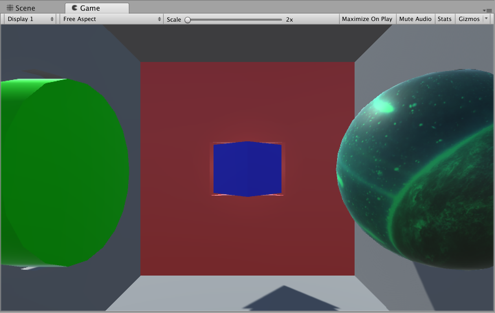

# iTechPractice01
Unity practice for materials and transformations

**Directions**

1. Download the file iTechPractice01.unitypackage
1. double click, and import Unity package
1. Open scene called practice
1. Adding shapes to the scene, to fill the matching shape and orientations.

        1. Add a cube to the scene (e.g 4.5 units scale), a rotation of 45 on Y axis
        2. Add a sphere (radius 10) to the scene, and place it in the sphere shape area
        3. Add a cylinder to the scene, and find out the right dimensions and orientation to match the cylinder area in Unity
1. Change the color of the sphere to blue.
1. Add a texturemap of your choice to the cube. You will find sample textures inside the Textures folder
1. Make the cylinder a green color.
1. Save your scene

Congrats,  you're done! 

---

## Example of a finished project

